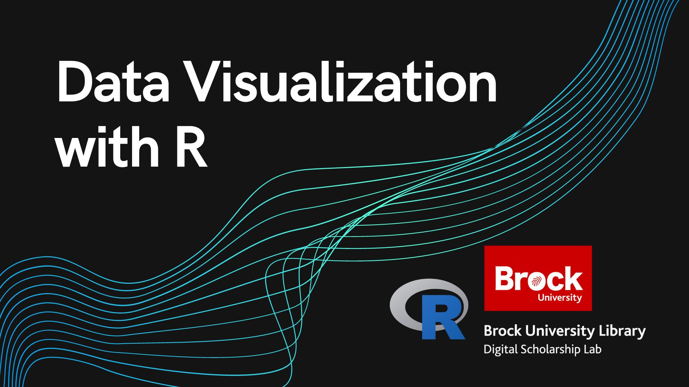
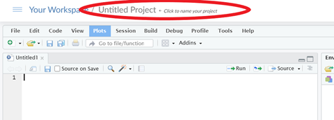

# Making Visualizations with R
In this workshop you will learn the basics of using the ggplot2 package to create visualizations in R.  This workshop covers:

- The layers of a visualization used by ggplot2 
- The basic types of visualizations you can make in R
- How to adjust aesthetic elements of your visualizations
- And how to integrate the creation of visualizations into your R workflows.

A basic understanding of the R programming language is recommended for this workshop.

*Estimated length of workshop: 1.5 hours*

----

## Setup Instructions
In preparation for this workshop, you will need to have a Posit account (previously was an R Studio Cloud account) and have a new R Studio project open on Posit Cloud.  Follow the steps below to get set up.

- (Skip this step if you already have an Posit account) Begin by going to [https://posit.cloud/](https://posit.cloud/) and signing up for an account by clicking on the "Sign Up" text at the top right of the screen, then click the grey "Sign Up" button and fill in the form (or use the convenient Google or GitHub options if you have one of those accounts)
- Log in to Posit
- You should arrive at your workspace.  From here click on the button that says, "New Project" and select "New R Studio Project"
- Once your project has finished building, open the "Source" window by clicking on the double box symbol in the top right corner of the "Console" window

- Rename your project by clicking on the name at the top.  Name it whatever you like (eg. "Data Visualization With R Workshop")

- Lastly, install and activate the "tidyverse" package.  This might take a couple minutes as it is a very large package. 

- And thats it!  You are all set for the workshop

----

## Workshop Tasks
**Task Set #1**
1. Look at the mpg dataset by running **mpg**.  Tidyverse (or at least ggplot2) must be installed and turned on.  (use **view(mpg)** if you want to see the whole dataset)
2. Read the documentation for the dataset using **?mpg** or **help(mpg)**
3. Make a point graph, mapping 2 columns of the mpg data as the x and y values.
4. Try making a few different point graphs using different values and when you are done type “POINT MADE!” in the chat

**Task Set #2**
1. Adjust your visualization to change the shape, size, and colour of the entire visualization.  
2. Pick one aesthetic element and use it in your mappings instead to show another column of data in your visualization.
3. Try different combinations of elements used in your mappings and outside you mappings to see what you get and when you are done type “GOT IT!” in the chat.

**Task Set #3**  

[Link to the PDF of the geometry cheat sheet](https://github.com/rstudio/cheatsheets/blob/main/data-visualization.pdf)

1. Create two more visualizations using geometries other than point.  Feel free to share your discoveries by pasting your code in the chat.
2. Once you have finished trying out new geometries, type “DONE!” in the chat.

**Task Set #4**
1. Create a visualization with at least 2 geometry layers.
2. Put the code for your visualization into a variable.
3. Add a labels layer to the visualization.
4. Save your visualization as a .jpg file and then type “SAVED!” in the chat.

----

## Follow Up Material
If you are looking to continue enhancing your knowledge of R, check out our other R workshops or try out one of the options below!

[R for Data Science](https://r4ds.had.co.nz/index.html)

[YaRrr! The Pirate's Guide to R](https://bookdown.org/ndphillips/YaRrr/)   
  
[W3Schools R Tutorial](https://www.w3schools.com/r/default.asp)

----

**This workshop is brought to you by the Brock University Digital Scholarship Lab.  For a listing of our upcoming workshops go to [Experience BU](https://experiencebu.brocku.ca/organization/dsl) if you are a Brock affiliate or [Eventbrite page](https://www.eventbrite.ca/o/brock-university-digital-scholarship-lab-21661627350) for external attendees.**

