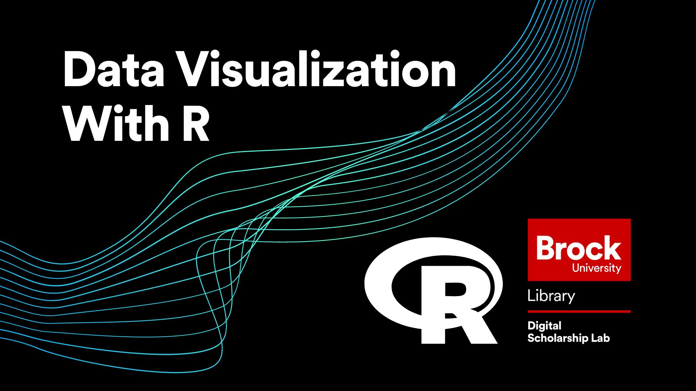

# Making Visualizations with R
In this workshop you will learn the basics of using the ggplot2 package to create visualizations in R.  This workshop covers:

- The layers of a visualization used by ggplot2
- The basic types of visualizations you can make in R
- How to adjust aesthetic elements of your visualizations
- And how to integrate the creation of visualizations into your R workflows.

A basic understanding of the R programming language is recommended for this workshop.

*Estimated length of workshop: 1.5 hours*

----

## Setup Instructions
In preparation for this workshop, you will need to have a Posit account (previously was an R Studio Cloud account) and have a new R Studio project open on Posit Cloud.  Follow the steps below to get set up.

- (Skip this step if you already have an Posit account) Begin by going to [https://posit.cloud/](https://posit.cloud/) and signing up for an account by clicking on the "Sign Up" text at the top right of the screen, then click the grey "Sign Up" button and fill in the form (or use the convenient Google or GitHub options if you have one of those accounts)
- Log in to Posit
- You should arrive at your workspace.  From here click on the button that says, "New Project" and select "New R Studio Project"
- Once your project has finished building, open the "Source" window by clicking on the double box symbol in the top right corner of the "Console" window

- Rename your project by clicking on the name at the top.  Name it whatever you like (eg. "Data Visualization With R Workshop")

- Lastly, install and activate the "tidyverse" package.  This might take a couple minutes as it is a very large package. 

- And thats it!  You are all set for the workshop

----

## Workshop Tasks
**Coming soon!**

----

## Follow Up Material
If you are looking to continue enhancing your knowledge of R, check out our other R workshops or try out one of the options below!

[YaRrr! The Pirate's Guide to R](https://bookdown.org/ndphillips/YaRrr/)   
  
[W3Schools R Tutorial](https://www.w3schools.com/r/default.asp)

----

**This workshop is brought to you by the Brock University Digital Scholarship Lab.  For a listing of our upcoming workshops go to [Experience BU](https://experiencebu.brocku.ca/organization/dsl) if you are a Brock affiliate or [Eventbrite page](https://www.eventbrite.ca/o/brock-university-digital-scholarship-lab-21661627350) for external attendees.**

